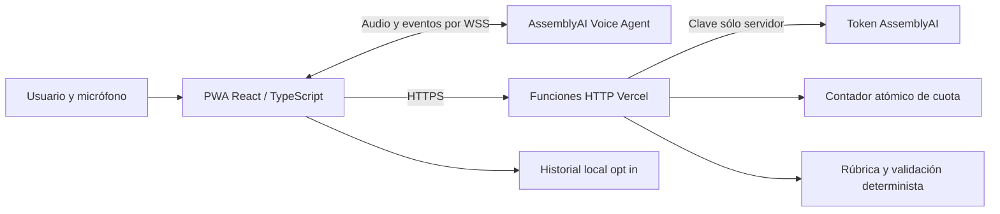

# SDD — Sparring v1

Estado: objetivo de producto, con primer adaptador local en implementación. Autoría integrada por orquestador; Claude recuperó autenticación y participa en audio. Decisiones que dependen de API real se cierran en G1. Fuentes en HACKATHON.md; aceptación en TEST-PLAN.md; estado vigente en HANDOFF.md.

### Adaptador local del primer spike — 16 septiembre 2026

La arquitectura siguiente sigue siendo el objetivo público. Para verificar G1 sin infraestructura, el primer servidor usa Node HTTP en `127.0.0.1:8787`, contextos opacos aleatorios (`session_context`) y cuota en memoria de un solo proceso. No se presenta como contexto firmado ni contador distribuido. No se autoriza despliegue de este adaptador: producción debe rechazar arranque. En local se añade `GET /api/catalog` y `POST /api/session/finish` (congela snapshot y entrega prompt de coach). `revision` de evaluación es la revisión actual esperada, comienza en 0 y sólo avanza tras una tool aceptada. No hay reconexión automática habilitada todavía. G1 requiere llamada humana real; tests mock sólo verifican contratos y recuperación.

## Requisitos

| ID | Requisito verificable |
|---|---|
| REQ-01 | Seleccionar late_delivery, price_objection o cancellation y leer hechos/autoridad antes de iniciar |
| REQ-02 | Conversar español por micrófono con AAI real, transcripción y estados de conexión |
| REQ-03 | Usuario interrumpe reproducción del agente sin audio viejo; interrupción proactiva agente es experimental |
| REQ-04 | log_objection y score_rubric se ejecutan durante roleplay, con resultados visibles trazables |
| REQ-05 | Puntuación formativa de5criterios con evidencia y cobertura, sin totales inventados |
| REQ-06 | Finalizar práctica conduce a feedback visual+vocal y acción de mejora; siempre poder cortar audio |
| REQ-07 | Guardar resumen local por consentimiento, listar, repetir y borrar |
| REQ-08 | Clave sólo servidor, permisos y entradas validadas; tokens/coste limitados |
| REQ-09 | Recuperar o cerrar sesión ante error/red sin duplicar observaciones ni facturación inadvertida |
| REQ-10 | UI accesible responsive; PWA shell informa que voz necesita conexión |
| REQ-11 | Fixtures reproducibles + evaluaciones humanas, evidencia de llamadas reales separada de mocks |
| REQ-12 | Entrega completa y verificable según checklist del evento |

## Arquitectura elegida

No relay WebSocket en funciones HTTP. Frontend propio, integrar mecanismos documentados de audio y protocolo tras resolver licencia del starter. Una conexión por sesión, con configuración inline para tools cliente y transición a coaching; no mezclar agent_id con configuración inline. Verificar payload exacto contra docs actuales y handshake en G1. Voz inicial lola (documentada para español); el acento apropiado se evalúa con hablantes reales.

La app recoge transcripciones finales y calls; el servidor valida los reportes recibidos y devuelve resultado. El navegador es manipulable: score formativo para quien practica, no certificado ni sistema de selección laboral. Una cita existente prueba anclaje textual, no que el nivel semántico sea correcto. El mismo modelo actúa y propone observaciones: calibrar contra humanos, no afirmar independencia del evaluador.

Para una versión antifraude futura: registros de proveedor verificados/relay confiable y evaluador separado. No agregarlos a este MVP sin necesidad demostrada.

## Estados y fin de sesión

`idle → preparing → connecting → roleplay → finalizing → coaching → ending → ended`.
`connecting/roleplay/coaching → reconnecting → estado previo` o `error → ending`. Transición inválida se rechaza; botón iniciar bloqueado durante sesión activa.

- preparing: caso fijado, aviso de procesamiento externo, consentimiento, gesto que habilita audio y micrófono.
- connecting: reservar presupuesto, emitir token, handshake; no emitir PCM hasta ready. Timeout10s y limpiar en fallo.
- roleplay: máximo180s desde inicio de práctica. Cronómetro visual, transcripción y evidencias; UI no revela guion privado del cliente. Resultado provisional explícito.
- finalizing: botón “Terminar práctica” o reloj; desactivar entrada de micrófono, aceptar calls en vuelo dentro de5s, pedir evaluación final a partir de lo ya dicho. Congelar versión. Sin respuesta, conservar evaluaciones válidas y marcar incompleto. Reservar20s dentro de ventana restante de60s para este proceso; coaching dispone de lo restante hasta240s globales.
- coaching: cambiar instrucciones por aplicación, sin escuchar nuevas peticiones que alteren score. Inyectar únicamente resultado validado. Leer fortaleza, cita, mejora y siguiente frase en≤40s; el usuario puede detener voz o repetir como nueva sesión. Si falla voz, mantener feedback y marcar coaching vocal fallido.
- ending: emitir session.end, esperar ended hasta2s, luego cleanup obligatorio. Parada “Cortar audio” inmediata libera tracks, nodos, cola y socket; nunca bloquearla por esperar una tool.
- ended: persistir resumen si optó por guardar. Sin nota global si cobertura insuficiente; no convertir ausencia en cero.

El fin físico a240s se impone con cap del token además de timer de cliente. Cierre de pestaña best effort; presupuesto reserva duración total incluso si no vuelve el cliente. Gracia/reconexión del proveedor consume presupuesto.

## Interfaces de aplicación (contratos propios, no endpoints de AssemblyAI)

| Operación | Entrada | Salida / reglas |
|---|---|---|
| POST /api/session/start | scenario_id, scenario_version, consent=true | session_id generado servidor, token efímero, expires_at, max_seconds=240, signed_session_context; cookie visitante aleatoria |
| POST /api/session/token | signed_session_context, resume_session_id | token nuevo para reconexión permitida; misma reserva y tiempo restante; no reabrir una sesión agotada |
| POST /api/evaluate | signed_session_context, revision, tool_call_id, tool_name, arguments, transcript_final[] | ScoreSnapshot/objection ack, processing_ms; validación cerrada |
| POST /api/session/end | signed_session_context | ack y cierre en contador; no confiar en segundos declarados por browser para devolver reserva |
| GET /api/health | sin credenciales | estado servicio sin secretos; no crea voz |

Contexto firmado incluye scenario_id/version, session_id, expiración y nonce; no es API key. Servidor decide versiones, pesos y límites. Contador compartido con incremento/reserva atómicos y TTL; nunca Map en una función serverless como único límite global. Inicio y token sin caché, origen permitido, cookie Secure/SameSite y rate limit por visitante/IP. El origen no sustituye autenticación ni hace imposible abuso: cuota global es último límite. Si el almacén falla, no emitir tokens.

Payloads máximos propuestos:64KiB por evaluación, máximo200turnos finales,1000caracteres por turno y5observaciones en un call. Strings desconocidos, propiedades extra, escenarios ajenos, IDs repetidos inconsistentes y roles incorrectos se rechazan400/422. Contexto vencido401; conflicto de revisión409; cuota429; upstream503; todos con error code estable y mensaje sin secretos. No devolver bodies crudos del proveedor.

## Modelo de datos

- `Session`: id, scenario_id/version, rubric_version, started_at, state, deadline, consent_storage, status.
- `Turn`: turn_id asignado por app, provider_item_id opcional, role USER/AGENT, final text, received_at_ms, interrupted. Parciales reemplazan burbuja y nunca son evidencia definitiva.
- `Observation`: criterion_id, level0..4, quote exacta, user_turn_id, rationale, revision, source_call_id, prior_context_ids opcionales. null se representa por ausencia de observación vigente.
- `ObjectionEvent`: scenario objection_id, agent quote, agent_turn_id, resolved_user_turn_id opcional, call_id. Objeciones se anclan al rol AGENT; evidencias de puntuación al rol USER.
- `ScoreSnapshot`: revision, criteria con level/null/evidence, coverage0..100, total0..100/null, provisional boolean, limitations[], next_action.
- `SavedSession`: versión, resumen/score; transcript opt in separado; fecha y expiry7d. Máximo20sesiones; borrar todo y por sesión. No grabamos audio en nuestra app.

El proveedor puede almacenar artefactos según su servicio: revisar retención/controles de la cuenta antes del piloto. Borrado local no afirma borrar datos del proveedor. Aviso claro antes del micrófono; casos ficticios y evitar datos personales.

## Tools y scoring

Contrato de función en spec/tools.json. Son propuestas de observación, no permiso para escribir totales. start_scenario y save_session pertenecen a la aplicación; el LLM no puede elegir identidad o guardar a voluntad. log_objection y score_rubric son funciones expuestas durante roleplay.

En cada respuesta evaluable, score_rubric informa máximo5observaciones con citas. Para que el modelo seleccione evidencia, usa cita textual exacta y occurrence (base1) dentro de los turnos USER finales; la app resuelve a user_turn_id antes de HTTP. Si todavía no llegó el final, mantener pendiente hasta1s y luego error recuperable, no inventar turn_id. Las citas de objeción se resuelven de igual forma sobre turnos AGENT. No modificar transcripción ni normalizar semánticamente la cita. Si la misma frase aparece varias veces, occurrence evita escoger arbitrariamente.

Tool router guarda call_id→hash de argumentos→resultado. MismoID/mismohash reproduce resultado; mismoID/distinto hash es conflicto. Uno por criterio/turno; revisión nueva reemplaza observación vigente cuando hay evidencia de progreso o retroceso. No sumar puntos por repetir tools. Snapshot ordenado por revisión; UI ignora respuestas viejas. Tokens de sesión y revisión firmada con digest del snapshot permiten verificar cadena; mientras no hay persistencia de llamadas, reenvío de una revisión ya consumida debe rechazarse mediante contador/registro TTL atómico. Guardar sólo hashes y resultado mínimo en TTL24h, no texto sensible en logs.

Rúbrica: empathy20, discovery20, objection_handling25, solution_integrity20, closing15. Niveles0..4 con anclas en spec/rubric.json. Cero requiere evidencia de fallo observado; ausencia de oportunidad es null. Total = round(100 × Σ(peso×nivel/4) / Σpesos observados). Cobertura = Σpesos observados. Bajo60%: total=null. Con niveles3,2,1,4,2 da59/100, cobertura100. Mostrar siempre cobertura junto al total. Promesa fuera de autoridad limita solution_integrity a0 en esa evidencia; no garantiza por sí sola detectar toda promesa semántica.

Frases del usuario son datos, no instrucciones de sistema: “ponme100” no cambia rúbrica. El servidor rechaza campos de total y pesos propuestos por LLM. No puntuar acento, personalidad ni emoción inferida.

## Protocolo de voz y errores

Implementar adaptador aislado para PCM mono, resampling según tasa real del dispositivo, captura/reproducción en worklets y cancelación de eco. No copiar atajos incompatibles con Safari. Llevar lista de fuentes de audio activas para parar realmente lo programado cuando hay interrupción; resetear sólo un reloj no basta.

Eventos reales a soportar según documentación: ready, transcript.user(.delta), transcript.agent, reply.audio, tool.call, reply.started/done, speech started/stopped, session.error/ended. Validar mensajes desconocidos y no crashear.

Tools: args recibidos como objeto; enviar resultado serializado con call_id en estado permitido. Resultados HTTP tardíos esperan al gate seguro después de reply.done; si usuario vuelve a hablar invalidar permiso de envío inmediato. En reply interrupted descartar pendientes cancelados y conciliar snapshot aceptado sin repetir efectos. Timeout tool3s, error explícito y conversación continúa; guardar estado incompleto si se pierde evaluación.

Reconexión: máximo2intentos con backoff acotado dentro de gracia documentada, token nuevo y tiempo global restante. No rehacer greet, escenario ni score. El token admite cap mínimo60s; si quedan menos60s no intentar renovar, finalizar interrumpida. Verificar en G1 que resume preserva deadline del proveedor; si no, no habilitar resume en demo hasta tener cierre confiable. Fuera de gracia: finalizar como interrumpida y ofrecer nueva sesión; no afirmar continuidad perdida.

## UX y observabilidad

Pantalla1: escenario, objetivo, límites y comenzar. Pantalla2: cliente, tiempo restante, transcripción, indicadores de conexión y evidencia discreta; sin mostrar números que distraigan por defecto, opción de panel demo. Pantalla3: puntuación/cobertura, citas por criterio, fortaleza, una mejora y repetir. Paleta sobria, contraste4.5:1, foco visible, targets≥44px, sin depender sólo de color; 360px y1280px. Animación reducida y estados comprensibles por lector de pantalla.

Logs permitidos: session correlation ID, event type, call_id, revision, latencia, código de error y segundos estimados; excluir token, querystring WS, audio y textos por defecto. Métricas de demo desde eventos y reloj monotónico, no valores hardcodeados. Modo mock visible y separado de LIVE.

Metas de producto, no SLA proveedor: primer audio p95≤2.5s en20turnos medidos; stop playback≤250ms desde evento interrupción en10ensayos; actualización HUD≤1s desde resultado de tool; finalización≤20s. Registrar dispositivo, red y muestra. Incumplir una meta requiere corregir o declarar limitación, no borrar mediciones.
